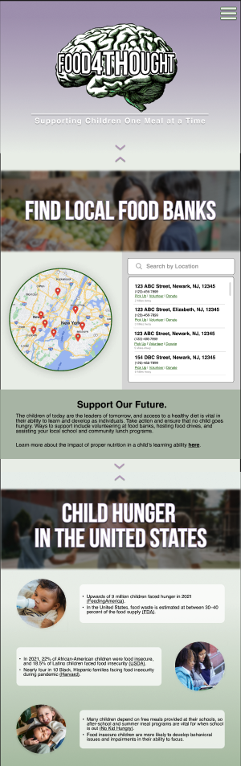

# Food4Thought
<i>CodePath Web Development 101 Project</i>

<h2>About the Project</h1>

  This website aims to bring awareness to child hunger in America – an often overlooked social justice issue. The content is informative and also serves as a tool to help children and families facing difficulty affording or accessing healthy food. The website emphasizes that today's children are our future, and a lack of nutrition stifles them from reaching their potential.

***
<h3>Intended Users</h3>
The website primarily targets families facing food insecurity because of its food bank locator. Still, its informative section is intended to spread awareness to people uninformed about the social justice issue. In summary, the intended users of the website would be people interested in accessing food resources, finding local food banks to volunteer in, and those interested in learning about child hunger in the United States.

***

<h3>Current Progress</h3>

  

***

<h3>Mockup</h3>

  

